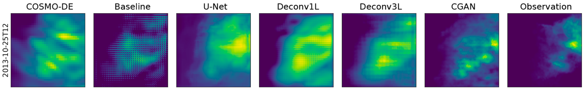

# CGANS for weather maps (and other models)

In this repository you can find the code of the development of deep learning models to generate high resolution precipitation maps based on the physical simulations. The algorithms doubles the resolution from 2.8km to 1.4km per pixel and corrects bias contained in the original forecast with a lead time of 3h.

# Project structure

## preprocessing.ipynb

The preprocessing routine loads the original COSMO-DE and radar data and pairs them using the correspondent time point. It also converts the input data to z-score and creates the train, validation and test sets. It writes the datasets in TFRecords format.

## evaluate.ipynb

The evaluate file loads each one of the trained models, saves and produces the respective predictions for the test set. The respective predictions are evaluated using different metrics and saved as a dictionary.

## plot.ipynb

The plot routine is in charge of loading the metrics of the models (saved as dicctionaries) and plot the respective results.

The training routins for each of the models can be found in each of the python scripts. The models were trained in a HPC system using MPI to distribute task between processors. Each of the following model scripts was submitted 20 times with random initializations in a different CPU. 

# Datasets

The datasets used to train and test the models can be accessed [here](https://zenodo.org/records/7244319).

# Models

To handle this complex forecasting tasks, different deep learning models where conceptualized, developed and tested. 

## Baseline model

Basic deconvolutional model used as a baseline model for comparison.

##  U-Net model

Adaptation of the U-Net architecture (Ronnenberger et al. 2015) used in the literature in super resolution (Serifi et al. 2021) and nowcasting of precipitation data (Ayzel et al. 2020). Used as a comparison point for new models. 

## Deconv1L model

Model that generates one set of 32 feature maps based on applying deconvolution kernels to the input data. A last convolution layer calculates the rain amount combining the high resolution feature maps.

## Deconv3L model

Inspired on the expansive path of the U-Net architecture, applies a max pooling layer followed by two deconvolution operations until getting the desired output resolution. A final convolutional layer calculates the rain. 

## CGAN model

Using the Deconv3L as a generator, the CGAN model complements the back propagation process of the loss with the probability of fooling an extra model (the discriminator). 

# Results

# Publication 

A complete report of the project and performance of the algorithms was published [here](https://gmd.copernicus.org/articles/16/1467/2023/gmd-16-1467-2023.html) in the [Geoscientific Model Development](https://www.geoscientific-model-development.net/) journal of [European Geosciences Union](https://www.egu.eu/).

### Abstract
> Numerical weather prediction (NWP) models are atmospheric simulations that imitate the dynamics of the atmosphere and provide high-quality forecasts. One of the most significant limitations of NWP is the elevated amount of computational resources required for its functioning, which limits the spatial and temporal resolution of the outputs. Traditional meteorological techniques to increase the resolution are uniquely based on information from a limited group of interest variables. In this study, we offer an alternative approach to the task where we generate precipitation maps based on the complete set of variables of the NWP to generate high-resolution and short-time precipitation predictions. To achieve this, five different deep learning models were trained and evaluated: a baseline, U-Net, two deconvolution networks and one conditional generative model (Conditional Generative Adversarial Network; CGAN). A total of 20 independent random initializations were performed for each of the models. The predictions were evaluated using skill scores based on mean absolute error (MAE) and linear error in probability space (LEPS), equitable threat score (ETS), critical success index (CSI) and frequency bias after applying several thresholds. The models showed a significant improvement in predicting precipitation, showing the benefits of including the complete information from the NWP. The algorithms doubled the resolution of the predictions and corrected an over-forecast bias from the input information. However, some new models presented new types of bias: U-Net tended to mid-range precipitation events, and the deconvolution models favored low rain events and generated some spatial smoothing. The CGAN offered the highest-quality precipitation forecast, generating realistic outputs and indicating possible future research paths.

### Reference
Rojas-Campos, A., Langguth, M. Wittenbrink, M. & Pipa, G. (2023). Deep learning models for generation of precipitation maps based on numerical weather prediction. Geoscientific Model Development, 16(5), 1467-1480, [doi:10.5194/gmd-16-1467-2023](https://gmd.copernicus.org/articles/16/1467/2023/gmd-16-1467-2023.html)